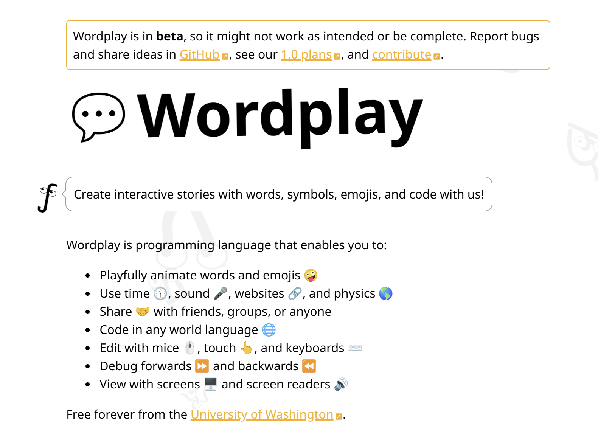
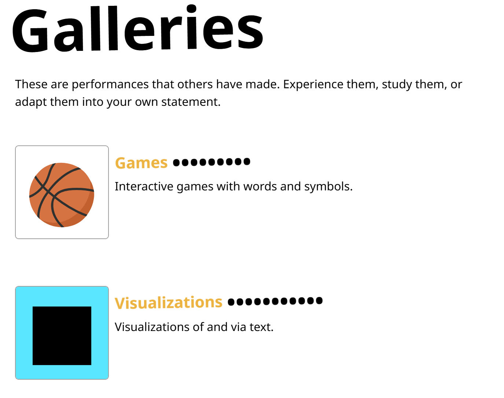








# About
Hi! I am an undergraduate student at the University of Washington, double majoring in Computer Science and Applied Mathematics.

# 📖 Educations
-  **University of Washington**, 2022.09 - 2026.06 (expected) 
Bachelor of Science in Computer Science 
Bachelor of Science in Applied Mathematics: Data Science

# 💼 Work Experience

- <strong>Shanghai Fudan University</strong>, *Jun–Sep 2024*  
  *Research Assistant*  
  - Professor Wei Wang's team participation, literature search, pollutant information extraction OCR research, model analysis, program design, project work report under the guidance of the professor

- <strong>Shanghai Chengdian Fuzhi Technology Co., Ltd.</strong>, *Jun–Sep 2023*  
  *Project Assistant*  
  - Database design for intelligent parking system, documentation of intelligent system design, system development specifications and database specifications, project management assisting.

# 🏅 Projects

  

    
    
  

  

    

      Wordplay: An Interactive Programming Language for Multilingual and Inclusive Expression
    

    

      UW iSchool & Allen School
    

    

      Participating in the development and testing of <strong>Wordplay</strong>, an interactive programming language designed for multilingual users and people with disabilities. Working on responsive data flow modules, graphical and interactive programming features, and contributed to an adaptable programming prototype. Regularly reported project progress, discussed human-computer interaction research topics, and summarized experimental findings.  
    

    

      <strong>Languages & Tools</strong>: JavaScript, TypeScript, HTML, CSS, Svelte/SvelteKit, Git
    

    

      
      
    

  

- **COVID-19 Vaccine Reservation System**  
  Designed and implemented a vaccine appointment scheduling system that allows users to create accounts, log in, check caregiver schedules, and reserve appointments through a terminal interface. Developed secure login with password hashing and salting, modeled patients and caregivers, and managed vaccine stock using SQL. Connected the system to a Microsoft Azure SQL database via JDBC.   
  **Languages & Tools**: Java, SQL, JDBC, Microsoft Azure  
  **Link**: [COVID-19 Vaccine Reservation System](https://github.com/lantinglu/COVID-19-Vaccine-Reservation-System)

- **tinyserv: Exploit Analysis & Patch Development**  
  Investigated real-world exploits on a vulnerable HTTP server (`tinyserv`), performed root-cause analysis, and wrote secure patches in C to prevent unauthorized access to admin-only pages. Ensured functional correctness and long-term security across both normal and malicious inputs.  
  **Languages & Tools**: C, Git, gdb, curl, HTTP   
  **Link**: [tinyserv](https://github.com/lantinglu/tinyserv)

- **Dynamic Storage Allocator**   
  Developed a dynamic memory allocator in C from scratch, implementing malloc, free, and heap coalescing using an explicit free list.  
  **Languages & Tools**: C, gdb  
  **Link**: [Dynamic Storage Allocator](https://github.com/lantinglu/CSE351-The-Hardware-Software-Interface/tree/main/lab5)

